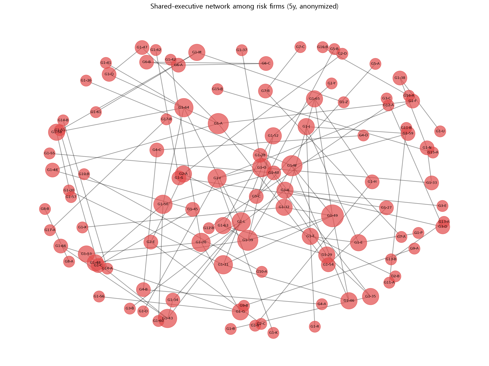

# 코스닥 무자본 M&A 위험 탐지 및 경영진 네트워크 분석
DART 전자공시와 KRX 공시 데이터를 활용해 코스닥 상장사의 무자본 M&A 위험 패턴을 탐지하고, 상장적격성 실질심사 대상 기업 간 경영진 네트워크를 분석하는 프로젝트입니다.

## 프로젝트 배경
무자본 M&A 자체는 위법이 아니지만 이를 이용한 소액 투자자의 피해가 발생하는 사례가 다수 발생하고 있습니다.
공개된 공시 데이터를 자동으로 취합·분석해 추가 검토가 필요한 후보 기업을 좁혀주는 스크리닝 도구를 만들고자 했습니다.

전형적 수법은 (1) 차입 자금으로 상장사를 인수한 뒤, (2) 전환사채·유상증자로 자금을 조달하고, (3) 이를 사적으로 유용(횡령)하며, (4) 최종적으로 상장폐지에 이르는 흐름을 보입니다.

본 프로젝트는 공개된 공시 데이터만으로 이러한 위험 패턴을 정량화하고, 나아가 상장폐지 기업들이 공유 경영진을 통해 하나의 네트워크로 연결되는지를 분석합니다. 특정 기업의 위법 여부를 단정하지 않으며, 추가 검토가 필요한 대상을 선별하는 스크리닝 도구를 지향합니다.

또한 분석 내용이나 기법은 금융감독원의 조사 내용과 kbs 다큐멘터리를 상당부분 참고하였습니다.

## 위험군 정의: 상장폐지에서 실질심사로

초기에는 "위험 사유로 상장폐지된 기업"을 위험군으로 정의했으나, 다음 세 가지 한계가 있었습니다.

- 상장폐지는 사유 발생보다 1~2년 이상 늦게 확정되어, 무자본 M&A의 핵심 사건(자금조달·경영권 변경)과 기준 시점이 어긋납니다.
- 위험 신호를 보였으나 심사를 거쳐 생존한 기업을 포착하지 못합니다.
- 표본이 작습니다(약 124개).

이를 보완하기 위해 위험군을 거래소의 상장적격성 실질심사 대상 기업으로 재정의했습니다. 실질심사 지정은 "거래소가 기업의 계속성·경영 투명성을 공식적으로 문제 삼은" 신호로, 폐지 여부와 무관하게 위험을 직접 포착합니다. 이 재정의로 표본이 224개로 늘고, 기준일을 사유발생일로 삼아 시점 정합성이 개선되었으며, 폐지되지 않고 생존한 위험 기업까지 포함하게 되었습니다.

무자본 M&A와 무관한 사유(5연속 영업손실, 대규모 손상차손, 감사의견 변경(비적정→적정), 자구이행 등)는 위험군에서 제외했습니다.

## 분석 개요

분석은 세 단계로 구성됩니다.

첫째, 2018년 이후 위험 사유로 실질심사 대상이 된 코스닥 기업(위험군)과 현재 상장 중인 코스닥 기업(대조군)을 대상으로 무자본 M&A 관련 공시 지표를 수집하고, 랜덤포레스트 모델로 위험 패턴을 학습합니다.

둘째, 학습된 모델로 현재 상장사를 스캔해 위험 패턴을 보이는 기업의 순위를 산출합니다.

셋째, 상장폐지 기업의 경영진 이력을 추적해 여러 부실기업에 반복 등장하는 인물과, 이들이 형성하는 기업 네트워크를 분석합니다.

## 데이터

- **DART Open API**: 기업별 공시 이력(최대주주·경영권 변경, 유상증자, 전환사채, 담보계약), 임원 명단
- **KRX KIND**: 실질심사 대상 법인, 상장폐지 현황, 불성실공시법인 지정, 횡령·배임 공시, 코스닥 상장법인 목록

## 변수의 선택

무자본 M&A의 단기 집중성을 고려해, 각 기업의 기준일(위험군은 사유발생일, 대조군은 현재)로부터 과거 2년간의 공시를 집계했습니다. 최종 예측 변수는 네 가지입니다.


1. 최대주주·경영권 변경 횟수
2. 유상증자 발생 건수
3. 전환사채 발행 건수
4. 최대주주 변경 수반 담보계약 건수

횡령·배임은 강력한 위험 신호이지만, 실질심사 사유의 다수를 차지해 위험군 정의에 이미 반영됩니다. 이를 예측 변수로도 사용하면 "위험군이므로 횡령이 있다"는 레이블 누출(label leakage)이 발생하므로, 예측 변수에서는 제외했습니다. 불성실공시 역시 위험군 정의에 포함되어 변수에서 제외했습니다.

## 모델

위 4개 지표로 랜덤포레스트 모델을 학습했습니다. 5-fold 교차검증 ROC-AUC는 0.808(±0.025)입니다.

위험군을 폐지에서 실질심사로 재정의하는 과정에서, 초기 폐지 기반 모델(ROC-AUC 0.862, ±0.077) 대비 평균 성능은 소폭 하락했으나 fold 간 표준편차가 크게 낮아졌습니다(±0.025). 이는 표본이 224개로 늘고, 위험군에 "심사받고 생존한 기업"이 포함되어 판별이 다소 어려워진 대신 모델이 더 견고하고 현실적인 위험(폐지 이전 단계)을 포착하게 된 결과입니다.

지표별 평균은 위험군이 대조군을 크게 상회합니다(경영권 변경 6.4배, 유상증자 4.7배, 전환사채 3.6배, 담보계약 6.2배). Feature importance는 이진 변수 편향을 고려해 MDI와 permutation importance를 함께 산출했으며, 경영권 변경과 유상증자가 가장 중요한 예측 인자로 나타났습니다.

표본은 위험군·대조군 각 224개이며, 클래스 균형을 위해 대조군을 위험군과 동일 수로 언더샘플링했습니다.

## 경영진 네트워크 분석

실질심사 대상 기업의 경영진이 여러 위험 기업에 반복 등장하는지를 추적했습니다. 상장폐지 기업만으로 한정하지 않은 것은, 폐지에 이르지 않았더라도 실질심사를 받은 시점에 이미 무자본 M&A 관련 인물이 관여했을 수 있고, 예측 모델의 위험군 정의와 분석 대상을 일치시켜 결과 해석의 일관성을 확보하기 위함입니다. 인물 식별은 이름과 생년월을 조합해 동명이인을 구분했습니다.

경영진 이력은 인물 이동의 장기성을 고려해 사유발생 전 5년까지 수집했습니다(지표는 사건의 단기성을 반영해 2년, 경영진은 이동의 장기성을 반영해 5년으로 관찰 창을 차등 적용). 사외이사·감사는 전문 자격자의 겸직으로 인한 무관한 연결을 만들 수 있어, 실질 경영진(대표이사·사내이사 등)만을 대상으로 했습니다. 네트워크 클러스터 구조는 더 완전한 연결을 반영하는 5년 기준으로 통일했습니다.

분석 결과, 여러 위험 기업이 공유 경영진을 통해 하나의 네트워크로 연결됨을 확인했습니다. 사유발생 직전(2년) 기준으로는 소규모 연결로 보이지만, 장기 이력(5년)으로 추적하면 최대 67개 기업이 하나의 대규모 클러스터로 묶였습니다. 다만 "한 인물이라도 공유하면 연결"하는 방식이므로, 이 클러스터는 단일 조직이 아니라 인물을 통해 간접 연결된 관계망으로 해석해야 합니다.

5년 기준 네트워크에서 위험 기업들은 다음과 같은 클러스터를 형성했습니다. 전체 110개 기업이 연결되었으며, 그중 최대 클러스터(그룹 1)에 67개 기업이 집중되어 있습니다.

| 클러스터 | 기업 수 |
|:---:|:---:|
| 그룹 1 | 67 |
| 그룹 2 | 5 |
| 그룹 3 | 5 |
| 그룹 4 | 4 |
| 그룹 5 | 3 |
| 그룹 6 | 3 |
| 그룹 7 | 3 |
| 그룹 8~10 | 2 |

하나의 클러스터에 67개 기업이 집중된 것은, 위험 기업들이 소수의 반복 등장 인물을 매개로 광범위하게 연결되어 있음을 시사합니다. 다만 이는 "한 인물이라도 공유하면 연결"되는 구조이므로, 단일 조직이 아니라 인물을 통해 간접적으로 이어진 관계망으로 해석해야 합니다.


*위험기업 간 공유 경영진 네트워크. 각 노드는 실질심사 대상 기업(익명 처리), 연결선은 공유 경영진을 나타낸다. 노드가 클수록 더 많은 기업과 연결된 허브다.*

## 통합 결과

세 층의 독립적 신호를 결합해 최종 경고 리스트를 구성했습니다.

- 위험 예측 모델의 위험 점수
- 현재 상장사 경영진 중 위험 기업 출신 인물의 존재 여부
- 해당 인물이 속한 네트워크 클러스터

서로 다른 데이터와 방법으로 산출된 이 신호들이 일부 기업을 반복적으로 지목했으며, 이러한 수렴은 개별 신호보다 높은 신뢰도를 제공합니다.

## 한계

- 레이블의 불확실성: 대조군(현재 상장사)은 "정상"이 아니라 "아직 실질심사 대상이 되지 않은 기업"으로, 위험이 잠재된 기업이 포함될 수 있습니다(Positive-Unlabeled 구조). 따라서 모델은 "위험/안전 판정"이 아니라 "폐지된 위험기업과의 패턴 유사도"로 해석해야 합니다.
- 표본 규모: 위험군 224개로, 재정의를 통해 개선했으나 여전히 대규모 통계 모델보다는 탐색적 분석에 가깝습니다.
- 관찰 기간 정렬: 위험군과 대조군의 관찰 시점이 완전히 일치하지 않아 시대적 효과가 일부 혼재할 수 있습니다.
- 미포착 수법: 유행 테마 신규사업 발표를 통한 주가 부양 등 뉴스·텍스트 분석이 필요한 수법은 본 분석에 포함하지 못했으며, 향후 확장 과제로 남깁니다.
- 인물 식별: 이름과 생년월 조합으로 동명이인을 최소화했으나 완전하지 않습니다.

## 해석상 유의

본 프로젝트의 결과는 공개 공시 데이터에 기반한 의심 정황의 선별이며, 특정 기업이나 개인의 위법 행위를 단정하지 않습니다. 위험 기업 출신 경력이나 활발한 자금조달은 정상적인 경영 활동일 수 있으며, 결과는 추가 검토를 위한 참고 자료로만 활용되어야 합니다. 개인 실명이 포함된 분석 결과물은 공개 저장소에 포함하지 않았으며, 네트워크 시각화는 익명화 버전을 사용합니다.


## 기술 스택

- 언어: Python 
- pandas, scikit-learn(RandomForest), networkx, matplotlib, OpenDartReader
- 데이터 소스1: DART Open API (금융감독원 전자공시시스템)
- 데이터 소스2: KIND(상장공시 시스템)에서 수동 다운로드

## 설치 및 실행

### 1. 패키지 설치
```bash
pip install OpenDartReader pandas openpyxl python-dotenv scikit-learn networkx matplotlib
```

### 2. API 키 설정
프로젝트 루트에 `.env` 파일을 만들고 발급받은 DART API 키를 입력합니다.
```
DART_API_KEY=발급받은_API_키
```
> DART API 키는 https://opendart.fss.or.kr 에서 무료로 발급받을 수 있습니다.

### 3. KIND 데이터 준비 (수동 다운로드)
KRX KIND(kind.krx.co.kr)에서 아래 파일을 받아 `input_files/` 폴더에 넣습니다.
또는 제공된 input_files를 사용해도 됩니다.
- 상장폐지현황
- 불성실공시법인 지정 내역
- 횡령·배임 공시 내역
- 코스닥 상장법인 목록


### 4. 실행
스크립트를 번호 순서대로 실행합니다. 각 단계는 중간 결과를 `data/`에 CSV로 저장하며, 다음 단계가 이를 이어받습니다.
 
```bash
python 1_build_dataset.py             # 학습 데이터셋 구축
python 2_collect_predict_features.py  # 예측 대상 지표 수집
python 3_train_model.py               # 위험 탐지 모델
python 4_predict.py                   # 현재 상장사 위험 점수 예측
python 5_build_executives.py          # 위험기업 경영진 수집 (2년·5년)
python 6_collect_current_execs.py     # 현재 상장사 경영진 수집
python 7_match_executives.py          # 경영진 매칭 (사외이사 제외)
python 8_build_groups.py              # 네트워크 클러스터 산출
python 9_visualize_network.py         # 네트워크 시각화
python 10_combine.py                  # 위험점수·경영진·네트워크 통합
```

## 프로젝트 구조

```
happy/
├── .env                          # DART API 키 (git 추적 제외)
├── .gitignore
├── README.md
│
├── input_files/                  # KIND 수동 다운로드 원본 (git 포함)
│   ├── 실질심사법인_전체.xls
│   ├── 불성실공시법인.xls
│   ├── 코스닥_횡령.xls
│   └── 코스닥_상장.xls
│
├── data/                         # 파이프라인 생성 결과 (git 추적 제외)
│   └── (중간·최종 CSV, 실명 포함 결과물)
│
├── collect_indicators.py         # 지표 수집 모듈 (다른 스크립트가 import)
│
├── 1_build_dataset.py            # 학습 데이터셋 구축
├── 2_collect_predict_features.py # 예측 대상 지표 수집
├── 3_train_model.py              # 위험 탐지 모델 (4개 지표)
├── 4_predict.py                  # 위험 점수 예측
├── 5_build_executives.py         # 위험기업 경영진 수집 (2년·5년)
├── 6_collect_current_execs.py    # 현재 상장사 경영진 수집
├── 7_match_executives.py         # 경영진 매칭 (사외이사 제외)
├── 8_build_groups.py             # 네트워크 클러스터 산출
├── 9_visualize_network.py        # 네트워크 시각화
└── 10_combine.py                 # 위험점수·경영진·네트워크 통합
```